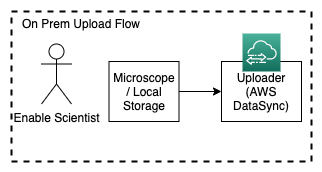

# EnableDataPipe

### Part 1: Backend Design

**Background**
* At Enable, being able to process and transform data is core to our product.
* At a high level, this involves developing an end-to-end data processing pipeline that
consists of:
  * Image processing techniques to optimize sample scans
  * Computer vision techniques to segment and cluster cells present in the sample
  * Running statistical analysis including cell frequencies, cell interactions, and more
* The most general requirements involve:
  * The ability to process peta-scale data yearly
  * The ability to migrate data collected on-prem to the cloud for cloud processing
  * The ability to move data through a multi-step data pipeline
  * The ability for scientists to verify outputs and data quality
  * The ability for users to monitor the progress of the data pipeline

High-level Questions
* What are your general, high level design ideas for this?
* What type of components or stages do we have to consider?
* What bottlenecks may we experience? Where?
* What forms of optimization can we perform?
* How can we ensure the end data is understandable and usable for the end-user?

### High Level

The initial design I came up with is based around events and queues. There are three main components:
1. Image sample input
2. Image sample processing
3. Monitoring each step of processing and output

Each component will be broken down in more detail below.

### Image Sample Input

This initial component of the architecture is decoupled from the rest of the processing and visualizing architecture. 
It is the only component that treats our scientists at Enable Medicine differently than the rest of our user base.

By initial estimates of 15TB of data uploaded into the cloud each week, AWS DataSync seems like an easy way to ensure reliable data transfer to the cloud. Once in the cloud, the rest of our pipeline will process image data more easily. Using the usage calculator, 60TB of data per month results in only $768 monthly. DataSync also comes with a scheduling agent that automatically detects changes in our local filesystem. 

This is most likely the simplest component in terms of design, but it is a surefire bottleneck in the whole process. 
Uploading a single TB over 1 Gbit/s speeds still takes ~2.5 hours to upload.
We can only reliably scale up to 9TBs per day, or 270TB per month, before we need to transfer to the cloud using another solution entirely.

Note that my design for non-Enable scientists is as follows:

This complexity is intentionally ignored here. If we want users to be able to upload their data from their local storage to our cloud storage, we will need to further develop a working solution.

### Image Processing

This processing pipeline is made up of two components:
1. Multiple stages of processing clusters and their source/destinations
1. External services that generate / collect metadata

This is an event-driven architecture, where each stage in the pipe is idle until the feed queue is populated.

The next section defines where events are generated and how they propagate through the pipe.

#### Event Lifecycle
1. User specifies an image to run through the data pipe
2. "Pipe Input Service" generates an initial event to the first stage in the data pipe, here named Proc Queue
3. After the stage's processing has completed, it sends another event to the next queue in the chain. The output data is stored in the stage's unique datastore. This datastore is a springboard for the next stages whose processing depends on the pre-processed data. It doubles as a way to visualize the intermediate steps' results as the image data propagates through the pipe.
4. The remaining stages (here named Vision Queue and Analysis Queue) process in the same way
5. The process event expires after the final stage is complete.

An event's structure would at least contain:
* Unique name
* Raw data location
* Stages required for processing

As our service expands, we will not necessarily always have a serial, one-size-fits-all processing path. We will need to expand to allow users to define their own path and stages required to process their image data. This complexity is not addressed in this design doc.

#### Processing Stages
Now that individual events have been defined, now we will define the structure of each stage, indifferent to the individual events that pass through it.

Each processing stage is made up of three components:
1. Input Queue
2. Processing Cluster
3. Output datastore

The "cluster" will consist of a Lambda step function that spins up an EMR cluster to process data. It will sit idle until the queue is populated. It will consume from the queue, and when output is complete, it will push to its individual datastore.

##### Scaling
1. Input queue scaling is unimportant

The key bottleneck to our data pipe is not the number of events, but the amount of compute and storage required for each individual one. Right now our overall throughput is not a concern.

2. Cluster processing can be scaled easily based on queue length

By using Lambda to schedule and run EMR clusters, we can scale our EMR compute power horizontally based on queue length. The feasibility of this is less concerning than the induced cost of scaling horizontally.

3. Output data can be archived

Each stage will output to our TK RDS and S3 instances. With a reasonable TTL, we'll archive each stage's output data to S3 Glacier, where we can store user's data for much longer and much cheaper. Users can still access potentially hundreds of TBs of data, and we don't have to persist them in low-latency settings due to their unpredictable and infrequent access patterns.

#### Processing Watchers
There are a couple different monitoring systems that makes the workflow transparent. Users will be able to see what the status of their job is, and service owners will be able to monitor the status of each stage of the pipeline independently. More of these watchers can be created easily in order to provide users greater insight into their job status. In the future, we may begin to process and aggregate the data from these watchers to provide more insight over the service itself.

##### Queue Watcher

For service owners:
* Provides data on queue length (indicating whether a stage is running smoothly, or clogged with errors)
* Provides data on events passing through the queue

For users:
* Provides data on status of scheduled events (pending resources, in process, or complete)

##### Cluster Watcher

For service owners:
* Provides data on errors within common processing steps

For users:
* Provides logs from processing steps

### Processing / Output Monitoring