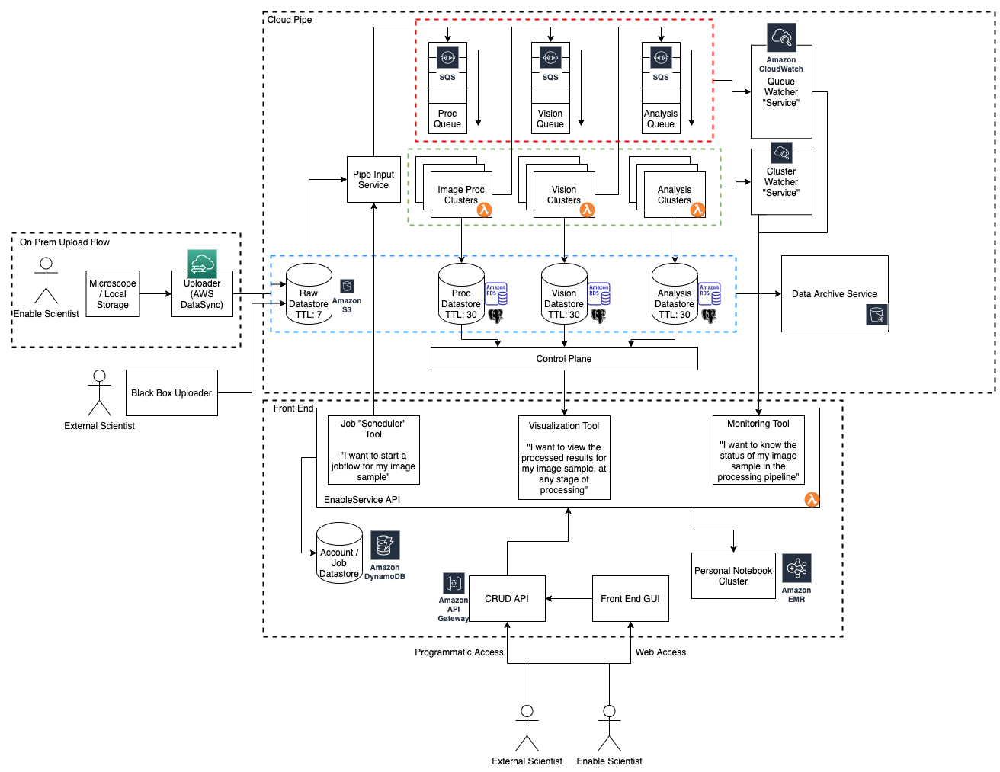

# EnableDataPipe

## Part 1: Backend Design

**Background**
* At Enable, being able to process and transform data is core to our product.
* At a high level, this involves developing an end-to-end data processing pipeline that
consists of:
  * Image processing techniques to optimize sample scans
  * Computer vision techniques to segment and cluster cells present in the sample
  * Running statistical analysis including cell frequencies, cell interactions, and more
* The most general requirements involve:
  * The ability to process peta-scale data yearly
  * The ability to migrate data collected on-prem to the cloud for cloud processing
  * The ability to move data through a multi-step data pipeline
  * The ability for scientists to verify outputs and data quality
  * The ability for users to monitor the progress of the data pipeline

High-level Questions
* What are your general, high level design ideas for this?
* What type of components or stages do we have to consider?
* What bottlenecks may we experience? Where?
* What forms of optimization can we perform?
* How can we ensure the end data is understandable and usable for the end-user?

### High Level

The initial design I came up with is based around events and queues. There are three main components:
1. Image sample input
2. Image sample processing
3. Monitoring each step of processing and output

Each component will be broken down in more detail below.

### Image Sample Input

This initial component of the architecture is decoupled from the rest of the processing and visualizing architecture. 
It is the only component that treats our scientists at Enable Medicine differently than the rest of our user base.

By initial estimates of 15TB of data uploaded into the cloud each week, AWS DataSync seems like an easy way to ensure reliable data transfer to the cloud.
Once in the cloud, the rest of our pipeline will process image data more easily. Using the usage calculator, 60TB of data per month results in only $768 monthly. 
DataSync also comes with a scheduling agent that automatically detects changes in our local filesystem. 

This is most likely the simplest component in terms of design, but it is a surefire bottleneck in the whole process. 
Uploading a single TB over 1 Gbit/s speeds still takes ~2.5 hours to upload.
We can only reliably scale up to 9TBs per day, or 270TB per month, before we need to transfer to the cloud using another solution entirely.

Note that my design for non-Enable scientists is as follows:

This complexity is intentionally ignored here. If we want users to be able to upload their data from their local storage to our cloud storage, we will need to further develop a working solution.

### Image Processing

This processing pipeline is made up of two components:
1. Multiple stages of processing clusters and their source/destinations
1. External services that generate / collect metadata

This is an event-driven architecture, where each stage in the pipe is idle until the feed queue is populated.

The next section defines where events are generated and how they propagate through the pipe.

#### Event Lifecycle
1. User specifies an image to run through the data pipe
2. "Pipe Input Service" generates an initial event to the first stage in the data pipe, here named Proc Queue
3. After the stage's processing has completed, it sends another event to the next queue in the chain. The output data is stored in the stage's unique datastore. This datastore is a springboard for the next stages whose processing depends on the pre-processed data. It doubles as a way to visualize the intermediate steps' results as the image data propagates through the pipe.
4. The remaining stages (here named Vision Queue and Analysis Queue) process in the same way
5. The process event expires after the final stage is complete.

An event's structure would at least contain:
* Unique name
* Raw data location
* Stages required for processing

As our service expands, we will not necessarily always have a serial, one-size-fits-all processing path. We will need to expand to allow users to define their own path and stages required to process their image data. This complexity is not addressed in this design doc.

#### Processing Stages
Now that individual events have been defined, now we will define the structure of each stage, indifferent to the individual events that pass through it.

Each processing stage is made up of three components:
1. Input Queue
2. Processing Cluster
3. Output datastore

The "cluster" will consist of a Lambda step function that spins up an EMR cluster to process data. It will sit idle until the queue is populated. It will consume from the queue, and when output is complete, it will push to its individual datastore.

##### Scaling
1. Input queue scaling is unimportant

The key bottleneck to our data pipe is not the number of events, but the amount of compute and storage required for each individual one. Right now our overall throughput is not a concern.

2. Cluster processing can be scaled easily based on queue length

By using Lambda to schedule and run EMR clusters, we can scale our EMR compute power horizontally based on queue length. The feasibility of this is less concerning than the induced cost of scaling horizontally.

3. Output data can be archived

Each stage will output to our S3 and replicate to our RDS instances.
With a reasonable TTL, we'll archive each stage's output data to S3 Glacier, where we can store user's data for much longer and much cheaper.
Users can still access potentially hundreds of TBs of data, and we don't have to persist them in low-latency settings due to their unpredictable and infrequent access patterns.

#### Processing Watchers
There are a couple different monitoring systems that makes the workflow transparent. Users will be able to see what the status of their job is, and service owners will be able to monitor the status of each stage of the pipeline independently. More of these watchers can be created easily in order to provide users greater insight into their job status. In the future, we may begin to process and aggregate the data from these watchers to provide more insight over the service itself.

##### Queue Watcher

For service owners:
* Provides data on queue length (indicating whether a stage is running smoothly, or clogged with errors)
* Provides data on events passing through the queue

For users:
* Provides data on status of scheduled events (pending resources, in process, or complete)

##### Cluster Watcher

For service owners:
* Provides data on errors within common processing steps

For users:
* Provides logs from processing steps
* Allows users to debug issues with custom pipeline stages

### Visualization / Customer Facing Service

For Enable and non-Enable users of our data pipeline service, they will be able to schedule, monitor, and analyze the results of jobs via
a simple CRUD API. I have gone into few details about the design of said service, other than noting a datastore for customer access / job details,
an interface modeled via API Gateway, and a basic Lambda service that will serve customer requests. This is hardly an in-depth design, and if given more time,
I would more effectively break down the datasets into logical tables, and flesh out the front end GUI (in which I would need to do some research of webapps hosted on AWS).

I've identified three "tools" that users will use, which will be hosted by our Lambda service.

#### Job Scheduler Tool
###### *"I want to start a jobflow for my image sample"*
Users will be able to create jobs based on image data already present in the pipeline's datastores. This will enable them
to schedule multiple jobs / processing flows based on the same image data simultaneously. This relies on the Pipe Input Service
that I've defined as part of the data pipeline design.

#### Visualization Tool
###### "I want to view the processed results for my image sample, at any stage of processing"
Users will be able to visualize image data present in any of the pipeline's datastores. This means that users will be able 
to check on data as it flows through the pipe, either to validate it or to begin analysis while further processing is completed. This relies
on multiple datastores that make up each stage in the pipeline.

Each datastore would be visible to a user's personal EMR cluster. This cluster will host a Jupyter notebook that a user can use
to interact with the data.

I would advocate against an in-house visualization tool, since I assume the use cases for visualization are so broad. It would
spread our team too thin if we were to develop this tool alongside the pipeline service.

#### Monitoring Tool
###### *"I want to know the status of my image sample in the processing pipeline"*
Users will be able to see what progress is made on their scheduled jobs, and any potential errors that have occurred during processing.
This will rely on the Queue and Cluster Watchers that I've defined as a part of the data pipeline.

### Bottlenecks
The first technical bottleneck we will run into is data transfer. I've mentioned above that at current scale, AWS Datasync will suffice,
as long as we can guarantee stable gigabit network speeds. As the input scale increases, we will quickly need to find another solution
to replace this. Jeff and I have discussed AWS Snowball, which would allow us to potentially transfer petabytes of data rapidly, but would force
us to batch data transfer, leading to longer data transfer SLAs. A hybrid solution could be another possible option down the road.

Due to the serverless nature of my pipeline design, there are few technical bottlenecks, as AWS will allow us to spin up a cluster for every job running in parallel.
The concern here is cost, so without a proper idea of our budget, I can't say how much we can scale before running into trouble.
It would be easy to tune our Lambda / EMR setup to reduce our overall cost, at the expense of longer processing times depending
on queue length.

Another bottleneck is data persistence, which I have addressed with the use of a data archival service like S3 Glacier. 
Storing petabytes of data in numerous RDS instances is not feasible, so shrinking the amount of data we keep "cached" in RDS is necessary.

### Optimizations
Optimizations beyond scaling up our parallel clusters would be to identify processing that can be done in parallel, i.e.
processing that does not depend on a previous processing step. Currently, the pipeline design is structured as if every stage
depends on the last, but there are potential custom stages that users may want to run in parallel. Running these steps side-by-side could greatly speed up
the delivery of users' desired output.

Tuning the amount of data we store before archiving it would also increase speed. If we consider RDS to be a "cache" due to the low-latency
interface it allows, increasing the amount of data it stores or caching the most used data will provide users a better experience.
The trade-off here is of course cost. Archiving our data will reduce cost and burden on our service, at the expense of users accessing their data quickly.

## Part 2: Coding

### Notes on Coding Style
These are some questions I would ask before publishing a code review:

#### Strict Input Validation & Error 
Should we err on the side of throwing exceptions when the data is incorrect? Or providing "empty" results? 
i.e. throw ValueError when theoretical co-occurrence has 0s, or replace zero division with NaN or value that flags invalidity.
  
#### Unit Testing / Code Smell
It was difficult to write the pairwise_logodds_ratio test with useful sample data. I ended up needing to "trust" my output
and copy+paste floats to do direct comparison, or re-implement some of the functionality in the unit test. How should I pull
in sample data without relying on the implementation I am testing?

I opted for rewriting the last step of the algorithm since I could easily hardcode the actual_frequency and theo_cooccurrence
as non-truncated single or double decimal floating point values.

### Notes on Design
The two steps documented in the prompt are split out into two top-level functions, that I test similarly to an API:
* provide some valid input and ensure valid output
* test with some different invalid input and ensure the failure behavior is as expected

Depending on the environment this would be run in, I might change the structure of this code by wrapping it in a class,
or leave it as a set of top-level functions to be run as steps in a transformation job definition.